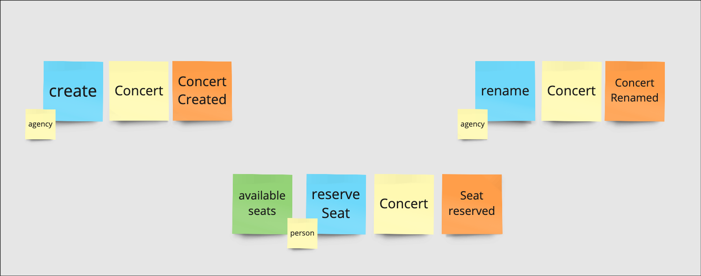

# Kysely poc

### Purpose
This is a proof of concept for [Kysely](https://github.com/kysely-org/kysely) library. It is a simple ticket reservation system with 3 bounded contexts: reservation, management and communication.
Main goals are:
- experimenting with the aggregate pattern with sql
- understanding how to use Kysely without a [Prisma](https://github.com/prisma/prisma) (especially for the migrations part)
- experimenting sql on tests side
- understand how much to extend and how the transactional scope to reduce complexity (perhaps with [nestjs-cls](https://github.com/Papooch/nestjs-cls))
- ...

### Next steps
- [x] Better tables name
- [ ] Change e2e entrypoint from service to controller (via api
- [ ] Try to centralise the transactional scope
- [ ] Switch from sqlite to postgres (to increase test complexity)

### Usage

```shell
# Install dependencies
pnpm i

# Run e2e tests
pnpm run test:e2e

# Run other tests
pnpm run test
```

### Event storming


### Structure
- reservation BC
  - **concert aggregate** write model persisted in `concerts` table
  - **available seats** read model persisted in `available_seats` table. (write in transaction with concerts)
- management BC
  - **concert** write model persisted in `management_concerts` table 
- communication BC
  - fake email channel