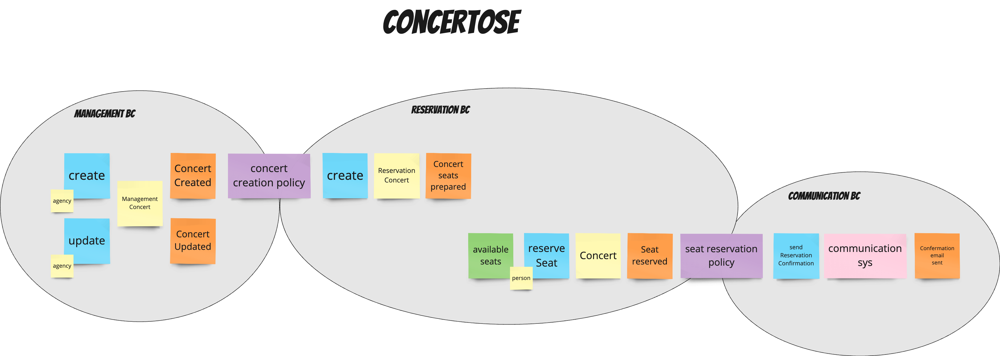

# Kysely poc

```shell
pnpm i
pnpm run test
```

## Event storming


## Structure
- concerts bounded context (soon reservation)
  - **concert aggregate** write model persisted in `concerts` table
  - **available seats** read model persisted in `available_seats` table. (write in transaction with concerts)